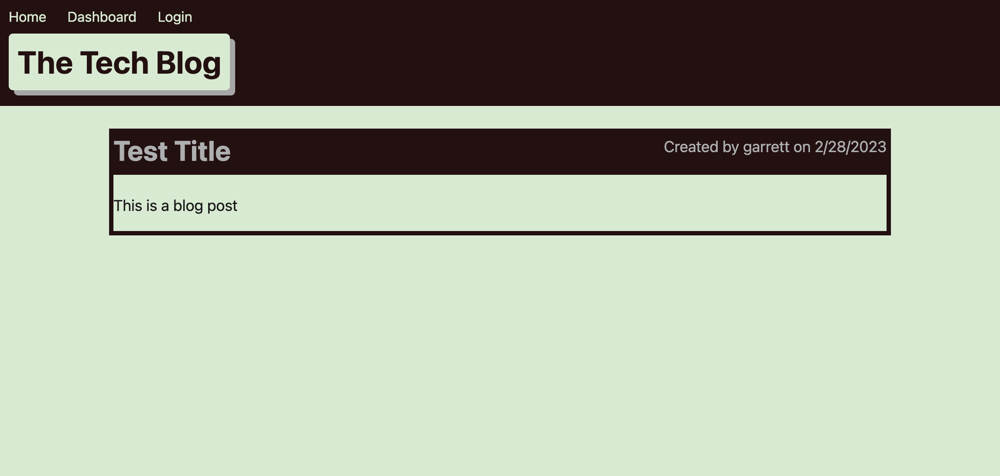

# tech-blog
A CMS-style blog site similar to a Wordpress site, where developers can publish their blog posts and comment on other developers’ posts as well.

## Description

CMS-style blog site similar to a Wordpress site, where developers can publish their blog posts and comment on other developers’ posts as well. A Full-Stack application deployed to Heroku. This app follows the MVC paradigm in its architectural structure, uses Handlebars.js as the templating language, Sequelize as the ORM, and the express-session npm package for authentication.

## Installation

Need to download the source files from the github repository onto local.

* Right click on `server.js` and open in integrated terminal.
* Run `npm i`
* Run `nodemon`
* Open `http://localhost:3001/` in a web browser to view the application locally.

## Usage

To view this application on Github, click [here](https://github.com/GarrettAnderson/tech-blog).

The application can be viewed [here](https://salty-reaches-84386.herokuapp.com/).

## Credits

Referenced previous in-class work assignments.

## License

There is no license and this repo is available for reproduction.
